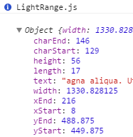

# LightRange.js
#### v.1.1.0

A **simple** and lightweight **selection, range and caret information** library in **native JavaScript**.




### Usage

LightRange.js is written in native JavaScript, so it **doesn't need any dependency**.
Just include [lightrange.js](lightrange.js) or [lightrange.min.js](lightrange.min.js) in `<head></head>` **or just before** `</body>` (**recommended**).

```html
  <script src="/your-custom-path/lightrange.min.js"></script>
  <script src="/another-path/your-script.js"></script>
</body>
```


Then, call the **lightrange function** :

```javascript
var range = lightrange();
```


LightRange.js provides **10 information** about the current range :

* `xStart` : **X** coordinate at the **beginning** of the range, in **pixels**.
* `yStart` : **Y** coordinate at the **beginning** of the range, in **pixels**.
* `xEnd` : **X** coordinate at the **end** of the range, in **pixels**.
* `yEnd` : **Y** coordinate at the **end** of the range, in **pixels**.
* `width` : **width** of the range.
* `height` : **height** of the range.
* `text` : **text content** of the range.
* `charStart` : coordinate at the **beginning** of the range, in **characters number**.
* `charEnd` : coordinate at the **end** of the range, in **characters number**.
* `length` : **length** of the range, in **characters number**.


### Compatibility

LightRange.js is **compatible with all modern browsers and with Internet Explorer 9 and above**.

[lightrange.ie8-.js](lightrange.ie8-.js) or [lightrange.ie8-.min.js](lightrange.ie8-.min.js) also **include Internet Explorer 8 and below support**. However, the library **doesn't provide charStart and charEnd for Internet Explorer 8 and below**.

LightRange.js is **not compatible** with `<input type="text" />` and `<textarea></textarea>` elements.


### Notes

* See [testing/playground.html](testing/playground.html) an example.

* If you like LightRange.js, please  this repository so it can **easily be found** and **help other developers**.

**Thank you !** :wink:


### License

LightRange.js is released under the [MIT License](LICENSE).
